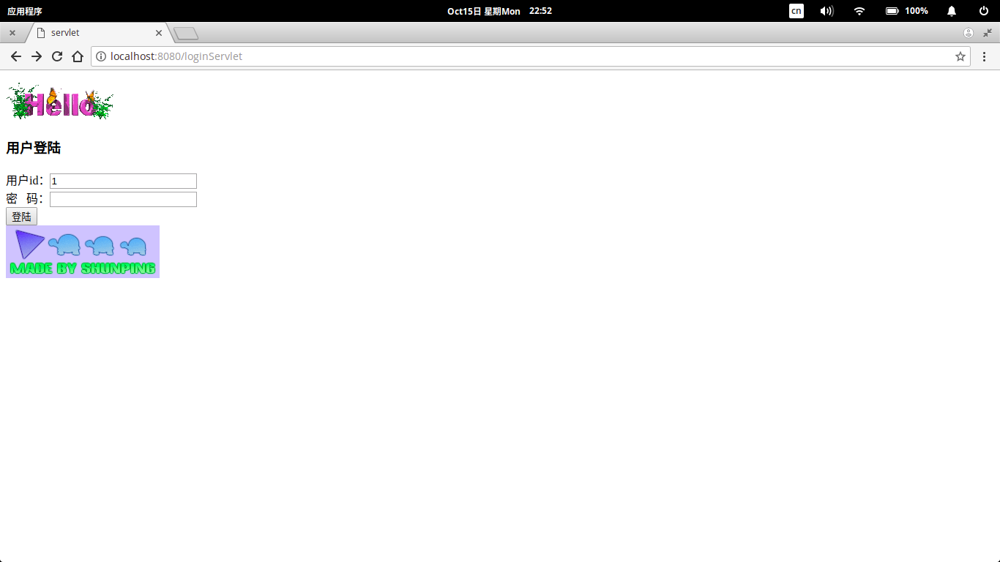
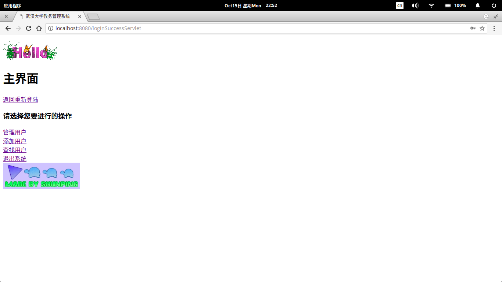
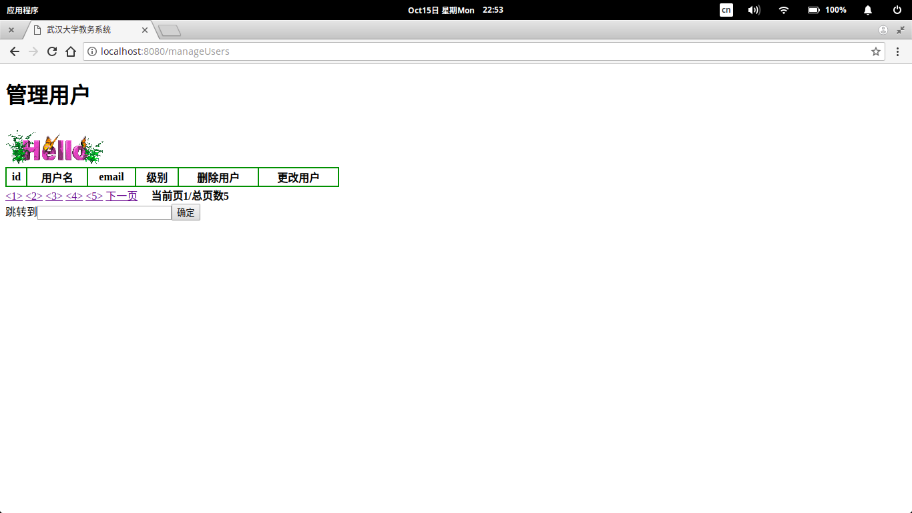

## Servlet案例

> 这是大三时学习servlet编写的简单代码，而且并不完善当时只做了一部分就放弃了。

Java Servlet 是运行在 Web 服务器或应用服务器上的程序，它是作为来自 Web 浏览器或其他 HTTP 客户端的请求和 HTTP 服务器上的数据库或应用程序之间的中间层.

Servlet 可以使用 **javax.servlet** 和 **javax.servlet.http** 包创建，它是 Java 企业版的标准组成部分，Java 企业版是支持大型开发项目的 Java 类库的扩展版本。

#### Servlet实现的三种方法

- 实现Servlet接口（ **ServletRequest**、**ServletResponse**、**ServletConfig**）
- 继承**GenericServlet**
- 继承HttpServlet（**HttpServletRequest**、**HttpServletResponse**）

#### Servlet的生命周期

- 创建Servlet的实例是由Servlet容器来完成，且创建Servlet实例是在初始化方法init之前。
- Servlet在多线程下其本身并不是线程安全。

#### 4种会话管理技术

- URL重写
- 隐藏域
- **cookies** （4KB，20个）
- **HttpSession**对象 （消耗服务器内存）

